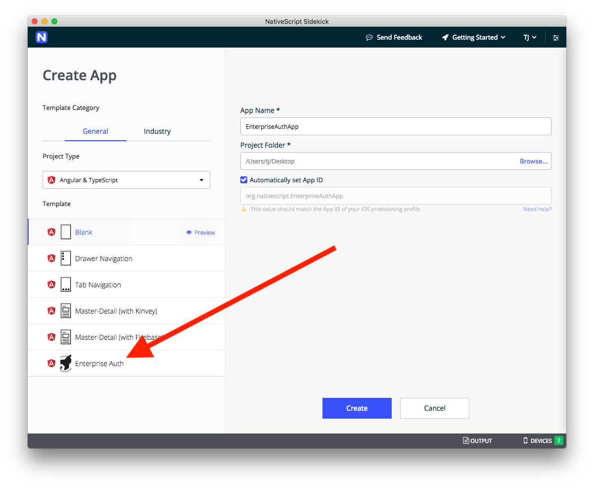

# Using Enterprise Authentication

NativeScript Sidekick lets you connect to existing enterprise identity and single sign-on solutions. This powerful functionality allows application developers to leverage enterprise user accounts, and to do so while avoiding the complexity of integrating these protocols into mobile apps.

This functionality also allows enterprise IT to ensure that access to resources is secured only to authenticated users, as well as maintaining full control over a mobile user's identity. 

Let’s look at how it works.

* [Step 1. Start an app using the Enterprise Auth template](#step-2)
* [Step 2. Select an authentication protocol](#step-2)
* [Step 3: Complete the configuration](#step-3)
* [Step 4: Run your app](#step-4)
* [Step 5: MOAR KINVEY](#step-5)

<h2 id="step-1">Step 1. Start an app using the Enterprise Auth template</h2>

As a first step, [create a new app](/sidekick/user-guide/create-app/create-app-from-template) using the Enterprise Auth template.

Give your app a name, and click **Create**. Sidekick will take a minute to scaffold your app, and then you’ll be ready to set up the connection to your enterprise auth provider.

<h2 id="step-2">Step 2. Select an authentication protocol</h2>

> **WARNING**: Completing this authentication setup can be hard, as the information you need to obtain varies depending on your auth provider. Therefore, you might need to work with your IT admins to help get the information that you need to make the connection, especially if you’re not familiar with the infrastructure behind your auth provider.

On the Enterprise Auth screen the first thing you’ll see is a collection of radio buttons, asking you to choose between **SAML-Redirect**, **OpenID Connect**, and **OAuth 2**.

Knowing which service you need means knowing a little bit about your enterprise authentication provider. Some providers only support one of the above protocols, while others allow you to choose between the protocol you prefer.

Once you’ve figured out which protocol your service supports, select the appropriate radio button and move on to the next step.

<h2 id="step-3">Step 3: Complete the configuration</h2>

Each authentication service requires a different set of values needed to make the connection. Therefore, refer to one of the following guides to help complete the rest of the necessary configuration.

* [Configuring **SAML-Redirect** Authentication](saml.md)
* [Configuring **OpenID Connect** Authentication](openid.md)
* [Configuring **OAuth 2** Authentication](oauth2.md)

<h2 id="step-4">Step 4: Run your app</h2>

After you’ve completed the authentication setup, your last step is to run your app and see your new authentication workflow in action.

> **TIP**: If you haven’t run an app on a device using NativeScript Sidekick before, check out our documentation on [running your app](https://docs.nativescript.org/sidekick/user-guide/run-app/run-app-on-device).

After Sidekick deploys your new app to your device(s) you should see an app that looks like this.

When you tap the **Log in** button, if all went well, you should be prompted to authenticate with your enterprise authentication provider. In the case of our Microsoft Azure-based example, the app prompts the user to authenticate with their Microsoft account.

> **NOTE**: Configuring enterprise authentication providers is very tricky. If you’re not seeing your auth screen as expected, or if you hit problems at any time throughout the process, feel free to [reach out on the NativeScript community forum](https://discourse.nativescript.org/c/Sidekick).

And that’s it! You’ve now successfully built an app that can connect to an enterprise authentication provider.

<h2 id="step-5">Step 5: MOAR KINVEY</h2>

Sidekick’s enterprise authentication implementation is powered by [Progress Kinvey](https://www.kinvey.com/), a leading backend app development platform, with powerful capabilities to connect to and use enterprise data sources.

Here are some other things you can do.
