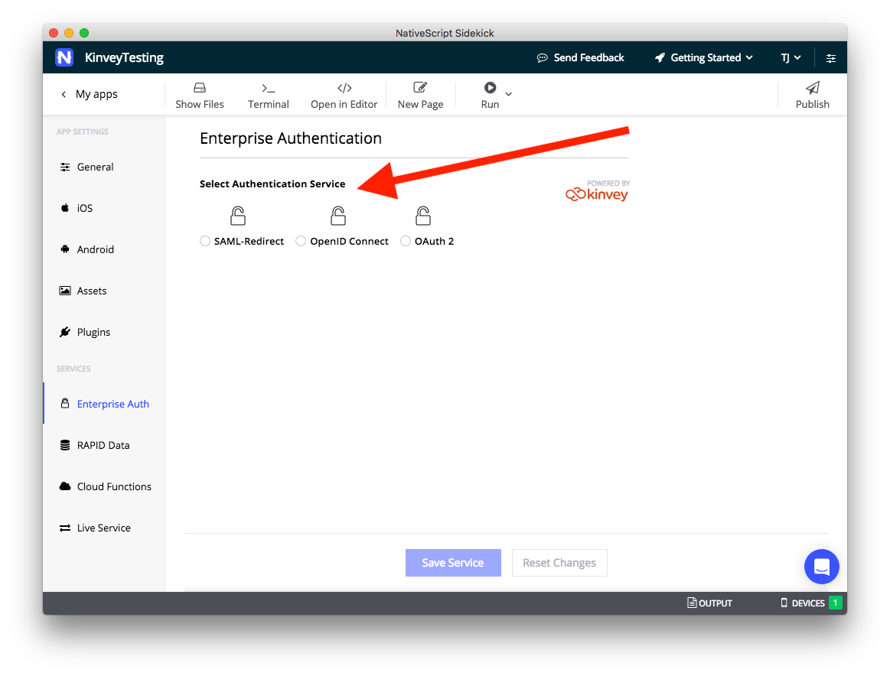

# Using Enterprise Authentication

NativeScript Sidekick lets you connect to existing enterprise identity and single sign-on solutions. This powerful functionality allows enterprise application developers to avoid the complexity of integrating these protocols into mobile apps, while also allowing enterprise IT to ensure that access to resources is secured only to authenticated users, as well as maintaining full control over a mobile user's identity. 

> **NOTE**: Sidekick’s enterprise authentication implementation is powered by [Progress Kinvey](https://www.kinvey.com/), a leading backend app development platform, with powerful capabilities to connect to and use enterprise data sources.

Let’s see how it all works.

## Selecting an authentication service

On the Enterprise Auth screen the first thing you’ll see is a collection of radio buttons, asking you to choose between **SAML-Redirect**, **OpenID Connect**, and **OAuth 2**.

So... how to do you choose?

## Running your app

