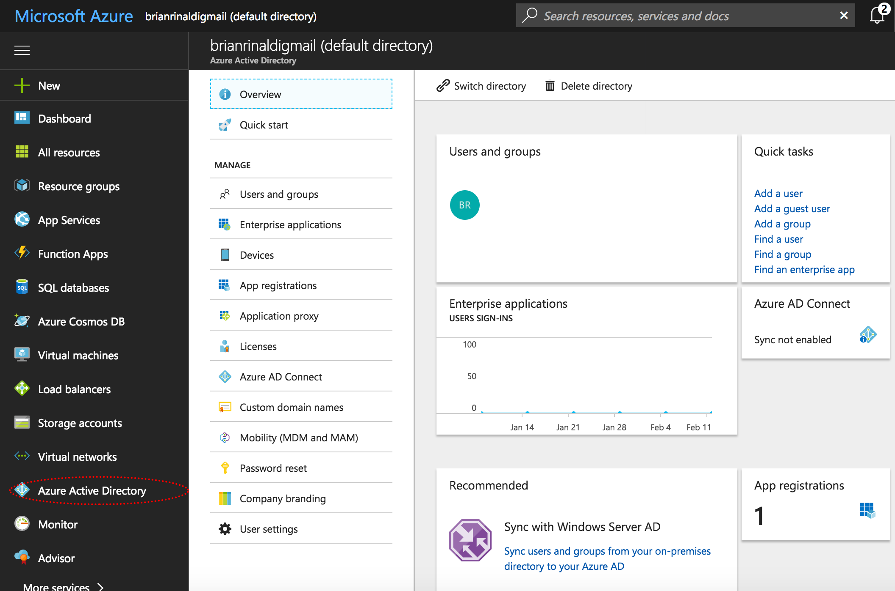
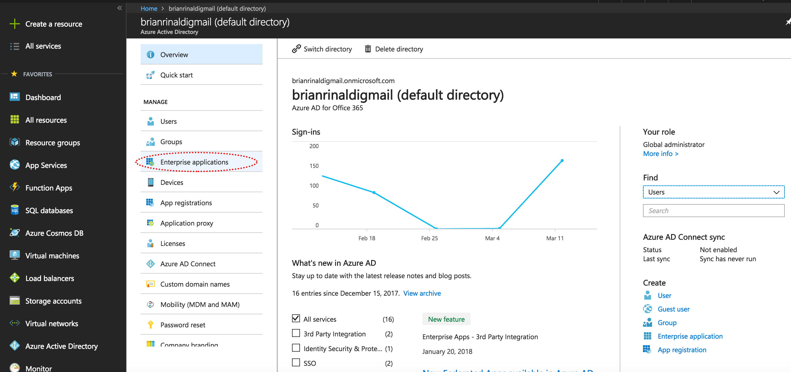
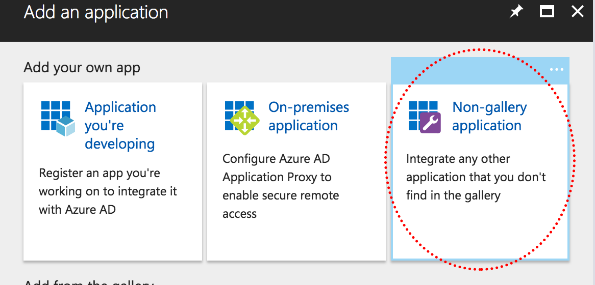
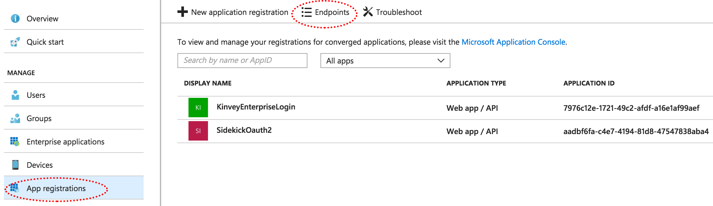
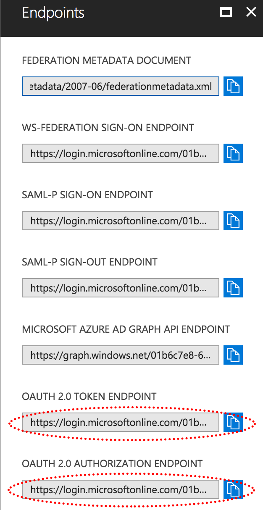
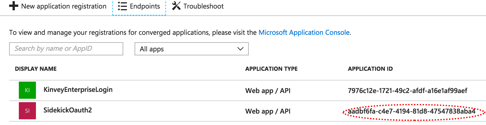

# Configuring SAML-Redirect Authentication

SAML, or Security Assertion Markup Language, is a standard for exchanging authentication and authorization data between security domains.

NativeScript Sidekick gives you the ability to connect to enterprise authentication providers via SAML. In this article we’ll look at the various data points NativeScript Sidekick needs to make the connection, and then look at a concrete example of a sample connection using Microsoft Azure.

## Configuring your connection

The first thing you need to do to configure a SAML-Redirect connection is to visit the **Enterprise Auth** screen and select the **SAML-Redirect** radio button. You should see a form that looks like this.

Let’s start by looking at the fields you need to provide to connect to your enterprise authentication provider. Then, as an example, we'll explore how we'd complete the form for a project using Azure Active Directory.

## Form Fields

Here is a list of the fields you need to provide in Sidekick, and a brief description of what they are.

|Field name|Description|
| ------------- |:-------------:|
|Name|The name can be anything you choose. NativeScript Sidekick will create a new service in Kinvey and the name is simply intended an an identifier to make it easier find your authentication service within the [Kinvey console](https://console.kinvey.com/).|
|Provider URI|This is the single sign on service URL where the request is initiated with the SAML authentication service that you are connecting to|
|Certificate Text|This is the Base64 text of the SAML signing certificate provided by the SAML authentication service.|
|Name ID Format URI|This is optional depending on the requirements of your SAML authentication provider. In simple terms, this specifies the kind of user identifier that the service will provide. The default value (`urn:oasis:names:tc:SAML:1.1:nameid-format:unspecified`) allows the provider to determine the format it will send the user identifier as we are not specifying a format (i.e. `unspecified`)|

Once all the fields are filled in appropriately, click the "Save Service" button to continue.

## Example - Azure Active Directory

While general field descriptions can be useful, it can be really helpful to see what this looks like in a real-world scenario. Microsoft offers a number of cloud services under the [Azure](https://azure.microsoft.com/en-us/) umbrella. On of these services is an Active Directory service called Azure Active Directory that functions similarly to the Windows Active Directory that many enterprises use. In this example, we'll set up Azure Active Directory and fill out the form with the values required to connect it within the Enterprise Authentication form using SAML-Redirect in NativeScript Sidekick.

### Setting Up Azure AD

The following steps will walk you through creating a new Azure Active Directory from scratch. If you already have Azure AD set up, simply skip step 1 below and complete steps 2 through 8.

1. From within the [Azure portal](https://portal.azure.com), click on Azure Active Directory or click on +New and search for Azure Active Directory.

	

2. Choose the "App Registrations" option and "Enterprise applications".
	
	

3. Click "+ New application" and then choose "Non-gallery application".

	
TODO finish steps

In order to test the log in process, Azure Active Directory will need a user. To add a user, go to Active Directory, click "Users and Groups", then "All Users", and finally "New User". For testing purposes, you could add yourself.

### Enterprise Authentication Form Field Values for Azure

Now that our Azure Active Directory is set up, let's look at the values within Azure that we need to complete the Enterprise Authentication form within NativeScript Sidekick.

* **Name**: Any name you choose.
* **Provider URI** and **Grant Endpoint**: To get these values from within Azure, go to Azure Active Directory, choose "App registrations" and then "Endpoints".

  

  On the subsequent page, the Provider URI is the OAuth 2.0 Token Endpoint value and the Grant Endpoint is the OAuth 2.0 Authorization Endpoint value.

  

* **Client ID** is the application ID found by going to Azure Active Directory and then choosing "App registrations".

  

* **Client Secret** is the value of the key created in step 8 above. If you did not copy the key during that step, it is hidden and you'll simply need to create a new key.
* **User ID Attribute** and **User ID Endpoint** can both be blank.
* **Scope** should be set to `email` to give your app access to the user's email address.
* **Include client ID in token request?** and **Include client secret in token request?** can both remain "No".

TODO: add a screenshot of the filled in Sidekick form.

Click the "Save Service" button and you are ready to move on to building and testing your NativeScript mobile app.