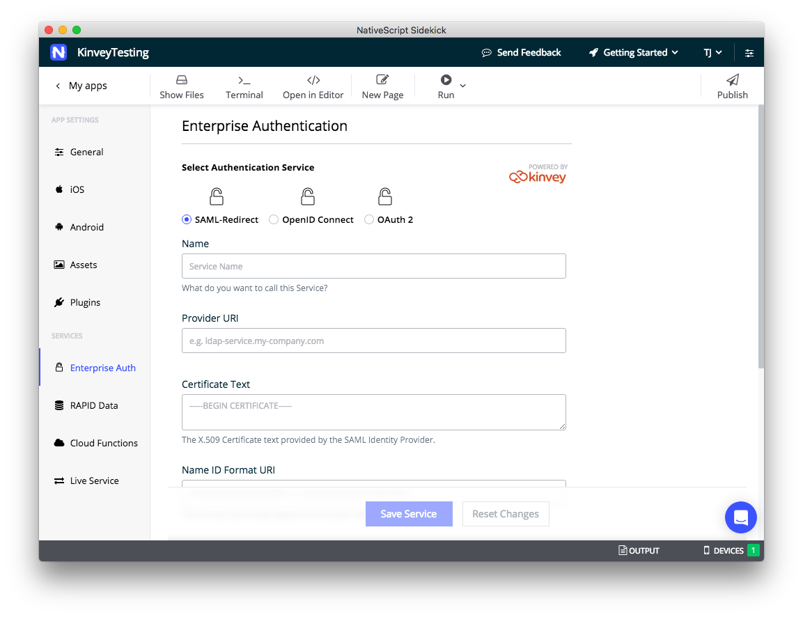

# Configuring SAML-Redirect Authentication

SAML, or Security Assertion Markup Language, is a standard for exchanging authentication and authorization data between security domains.

NativeScript Sidekick gives you the ability to connect to enterprise authentication providers via SAML. In this article we’ll look at the various data points NativeScript Sidekick needs to make the connection, and then look at a concrete example of a sample connection using Microsoft Azure.

## Configuring your connection

The first thing you need to do to configure a SAML-Redirect connection is to visit the **Enterprise Auth** screen and select the **SAML-Redirect** radio button. You should see a form that looks like this.

Form fields:

Name

Provider URI

Certificate Text

Name ID Format URI